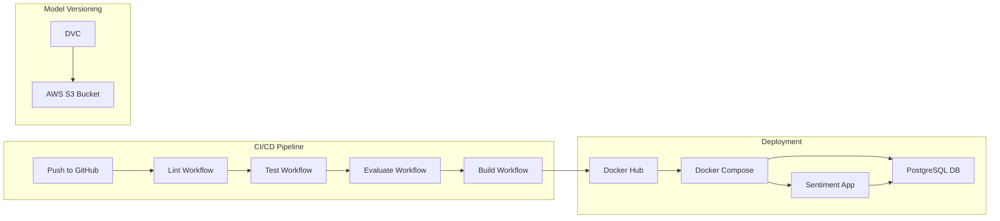

# MLOps Sentiment Analysis Project

A comprehensive MLOps project for sentiment analysis of app reviews using BERT (Bidirectional Encoder Representations from Transformers). This project demonstrates a complete machine learning pipeline from data extraction to model deployment, following best practices in code organization, testing, version control, and **MLOps workflows**.

## Table of Contents

- [Overview](#overview)
- [Project Structure](#project-structure)
- [MLOps Workflow](#mlops-workflow)
- [Components](#components)
- [Installation](#installation)
- [Usage](#usage)
- [Docker Deployment](#docker-deployment)
- [Testing](#testing)
- [Model Details](#model-details)
- [Development](#development)
- [License](#license)

## Overview

This project implements an end-to-end sentiment analysis pipeline that:
- Extracts and validates app review data
- Processes and cleans text data
- Trains a BERT-based classifier for sentiment prediction
- Provides an inference interface for making predictions

The model classifies app reviews into three sentiment categories:
- **Negative** (1-2 stars)
- **Neutral** (3 stars)
- **Positive** (4-5 stars)

## Project Structure

```
├── .github/
│   └── workflows/                # GitHub Actions CI/CD
│       ├── lint.yml              # Code linting (flake8)
│       ├── test.yml              # Unit testing pipeline
│       ├── evaluate.yml          # Model evaluation workflow
│       └── build.yml             # Docker build and publish
├── src/                          # Source code
│   ├── __init__.py
│   ├── data_extraction.py        # Data loading and validation
│   ├── data_processing.py        # Text cleaning and preprocessing
│   ├── model.py                  # Model training pipeline
│   ├── inference.py              # Inference and prediction
│   └── database.py               # PostgreSQL logging module
├── tests/                        # Unit tests
│   └── unit/
│       ├── test_data_extraction.py
│       ├── test_data_processing.py
│       ├── test_model.py
│       └── test_inference.py
├── data/                         # Dataset directory
│   └── dataset.csv               # App reviews dataset
├── models/                       # Model artifacts
│   ├── best_model_state.bin      # Trained model weights
│   └── best_model_state.bin.dvc  # DVC tracking file
├── db/
│   └── init.sql                  # PostgreSQL schema initialization
├── results/
│   └── evaluation_report.txt     # Model evaluation metrics
├── .dvc/                         # DVC configuration
├── Dockerfile                    # Container definition
├── docker-compose.yml            # Multi-container orchestration
├── .dockerignore                 # Docker build exclusions
├── .gitignore
└── requirements.txt              # Python dependencies
```

## MLOps Workflow

This project implements a complete MLOps pipeline with automated CI/CD, model versioning, containerization, and inference logging.

### Architecture Overview



### CI/CD Pipeline (GitHub Actions)

The project uses a chained workflow architecture where each stage triggers the next upon success:

#### 1. Lint Workflow ([.github/workflows/lint.yml](.github/workflows/lint.yml))
- **Trigger:** All pushes and pull requests
- **Purpose:** Code quality enforcement using flake8
- **Checks:** PEP 8 compliance for `src/` and `tests/`

```bash
# Manual local run
flake8 src tests
```

#### 2. Test Workflow ([.github/workflows/test.yml](.github/workflows/test.yml))
- **Trigger:** Push to `main` branch and all pull requests
- **Purpose:** Run unit tests with pytest
- **Coverage:** All modules in `tests/unit/`

```bash
# Manual local run
pytest tests/unit
```

#### 3. Evaluation Workflow ([.github/workflows/evaluate.yml](.github/workflows/evaluate.yml))
- **Trigger:** After successful Test Workflow on `main`
- **Purpose:** Evaluate model performance on validation data
- **Output:** `results/evaluation_report.txt` uploaded as artifact

```bash
# Manual local run
python -m src.model --evaluate --output results/evaluation_report.txt
```

#### 4. Build Workflow ([.github/workflows/build.yml](.github/workflows/build.yml))
- **Trigger:** After successful Evaluation Workflow on `main`
- **Purpose:** Build and publish Docker image to Docker Hub
- **Tags:** `latest` and commit SHA

**Required Secrets:**
| Secret | Description |
|--------|-------------|
| `DOCKERHUB_USERNAME` | Docker Hub username |
| `DOCKERHUB_TOKEN` | Docker Hub access token |
| `AWS_ACCESS_KEY_ID` | AWS credentials for DVC pull |
| `AWS_SECRET_ACCESS_KEY` | AWS secret key |
| `AWS_DEFAULT_REGION` | AWS region (e.g., `eu-west-3`) |

### Model Versioning (DVC + AWS S3)

Model artifacts are versioned using [DVC](https://dvc.org/) with AWS S3 as the remote storage backend.

**Configuration (`.dvc/config`):**
```ini
[core]
    remote = s3remote
['remote "s3remote"']
    url = s3://sentiment-analysis-bucket-practice/storage
    region = eu-west-3
```

**Key Commands:**
```bash
# Pull model from remote
dvc pull models/best_model_state.bin.dvc

# Push new model version
dvc add models/best_model_state.bin
dvc push

# Check status
dvc status
```

### Inference Logging (PostgreSQL)

All predictions are logged to a PostgreSQL database for monitoring and analysis.

**Database Schema ([db/init.sql](db/init.sql)):**
```sql
CREATE TABLE IF NOT EXISTS inference_logs (
    id SERIAL PRIMARY KEY,
    text TEXT NOT NULL,
    sentiment VARCHAR(20) NOT NULL,
    confidence FLOAT NOT NULL,
    created_at TIMESTAMP DEFAULT CURRENT_TIMESTAMP
);
```

**Module:** [src/database.py](src/database.py)
- Automatic logging on each prediction
- Configurable via environment variables
- Graceful failure handling (predictions continue even if DB is unavailable)

## Components

### 1. Data Extraction ([src/data_extraction.py](src/data_extraction.py))

Handles loading and validation of CSV data files.

**Key Functions:**
- `load_file(path)`: Loads CSV files with validation
- `check_columns(df)`: Validates required columns in the dataset

**Required Columns:**
- content, score, reviewId, userName, userImage, thumbsUpCount
- reviewCreatedVersion, at, replyContent, repliedAt, sortOrder, appId

**Example:**
```python
from src.data_extraction import load_file, check_columns

# Load the dataset
df = load_file('data/dataset.csv')

# Validate columns
if check_columns(df):
    print("Dataset is valid!")
```

### 2. Data Processing ([src/data_processing.py](src/data_processing.py))

Provides text cleaning, tokenization, and dataset preparation functionality.

**Key Functions:**
- `clean_text(text)`: Cleans and normalizes text
  - Converts to lowercase
  - Removes URLs, mentions, and special characters
  - Handles missing values

- `add_sentiment_label(df)`: Maps star ratings to sentiment labels

- `clean_dataset(df)`: Applies full cleaning pipeline

- `split_data(df, test_size=0.2)`: Stratified train/validation split

- `tokenize_data(texts, tokenizer, max_len=160)`: Tokenizes text using BERT tokenizer

- `ReviewDataset`: Custom PyTorch Dataset class for batch loading

**Example:**
```python
from src.data_processing import clean_dataset, split_data, ReviewDataset
from transformers import AutoTokenizer

# Clean the dataset
cleaned_df = clean_dataset(df)

# Split into train and validation sets
train_df, val_df = split_data(cleaned_df, test_size=0.2)

# Create dataset for training
tokenizer = AutoTokenizer.from_pretrained('bert-base-cased')
train_dataset = ReviewDataset(
    reviews=train_df['content'].values,
    targets=train_df['label'].values,
    tokenizer=tokenizer,
    max_len=160
)
```

### 3. Model Training ([src/model.py](src/model.py))

Implements the complete training pipeline using BERT for sequence classification.

**Key Functions:**
- `get_device()`: Detects GPU/CPU availability
- `create_model(n_classes, model_name='bert-base-cased', dropout=0.1)`: Initializes BERT model
- `create_optimizer_and_scheduler(model, train_loader, epochs, lr)`: Sets up optimizer and scheduler
- `train_epoch(model, data_loader, optimizer, device, scheduler)`: Trains for one epoch
- `eval_model(model, data_loader, device)`: Evaluates model performance
- `train_model(...)`: Full training pipeline with model saving

**Example:**
```python
from src.model import create_model, train_model, get_device
from torch.utils.data import DataLoader

# Create model
device = get_device()
model = create_model(n_classes=3)

# Create data loaders
train_loader = DataLoader(train_dataset, batch_size=16, shuffle=True)
val_loader = DataLoader(val_dataset, batch_size=16)

# Train the model
history = train_model(
    model=model,
    train_loader=train_loader,
    val_loader=val_loader,
    epochs=10,
    device=device,
    learning_rate=2e-5,
    model_save_path='best_model_state.bin'
)
```

**Training Configuration:**
- Model: `bert-base-cased`
- Optimizer: AdamW with learning rate 2e-5
- Scheduler: Linear warmup
- Max sequence length: 160 tokens
- Number of classes: 3 (negative, neutral, positive)

### 4. Inference ([src/inference.py](src/inference.py))

Provides an interface for making predictions on new reviews.

**Key Class:**
- `SentimentPredictor`: Loads trained model and provides prediction methods
  - `predict(text)`: Single text prediction
  - `predict_batch(texts)`: Batch predictions

**Example:**
```python
from src.inference import SentimentPredictor

# Initialize predictor
predictor = SentimentPredictor(model_path='best_model_state.bin')

# Single prediction
result = predictor.predict("This app is amazing! I love it!")
print(f"Sentiment: {result['sentiment']}")
print(f"Confidence: {result['confidence']:.2%}")

# Batch prediction
texts = [
    "Great app, very useful",
    "Terrible experience, keeps crashing",
    "It's okay, nothing special"
]
results = predictor.predict_batch(texts)
for result in results:
    print(f"{result['text'][:50]}... -> {result['sentiment']} ({result['confidence']:.2%})")
```

**Command-Line Interface:**
```bash
# Run interactive prediction
python -m src.inference

# Specify custom model path
python -m src.inference --model_path path/to/model.bin
```

## Installation

### Prerequisites
- Python 3.7 or higher
- pip package manager

### Setup Instructions

1. **Clone the repository:**
```bash
git clone https://github.com/alex-aworet/alex-aworet-Sentiment-Analysis-Project-Alex-Kristale-Amina.git
cd your_folder
```

2. **Create a virtual environment (recommended):**
```bash
python -m venv venv
source venv/bin/activate  # On Windows: venv\Scripts\activate
```

3. **Install dependencies:**
```bash
pip install -r requirements.txt
```

**Note:** You'll also need to install PyTorch and Transformers:
```bash
pip install torch transformers scikit-learn numpy
```

4. **Verify installation:**
```bash
pytest tests/
```

## Usage

### Quick Start

1. **Prepare your data:**
   - Place your CSV file in the [data/](data/) directory
   - Ensure it contains the required columns

2. **Train the model:**
```python
from src.data_extraction import load_file
from src.data_processing import clean_dataset, split_data, ReviewDataset
from src.model import train_model, create_model, get_device
from transformers import AutoTokenizer
from torch.utils.data import DataLoader

# Load and prepare data
df = load_file('data/dataset.csv')
cleaned_df = clean_dataset(df)
train_df, val_df = split_data(cleaned_df)

# Create datasets
tokenizer = AutoTokenizer.from_pretrained('bert-base-cased')
train_dataset = ReviewDataset(train_df['content'].values, train_df['label'].values, tokenizer)
val_dataset = ReviewDataset(val_df['content'].values, val_df['label'].values, tokenizer)

# Create data loaders
train_loader = DataLoader(train_dataset, batch_size=16, shuffle=True)
val_loader = DataLoader(val_dataset, batch_size=16)

# Train
device = get_device()
model = create_model(n_classes=3)
history = train_model(model, train_loader, val_loader, epochs=5, device=device)
```

3. **Make predictions:**
```python
from src.inference import SentimentPredictor

predictor = SentimentPredictor('best_model_state.bin')
result = predictor.predict("Your review text here")
print(result)
```

### Running the Full Pipeline

The [src/model.py](src/model.py) file includes a complete example in the `__main__` section:

```bash
python -m src.model
```

This will:
1. Load the dataset from [data/dataset.csv](data/dataset.csv)
2. Clean and preprocess the data
3. Split into train/validation sets
4. Train the BERT model
5. Save the best model to `best_model_state.bin`

## Docker Deployment

The project includes Docker containerization for easy deployment with PostgreSQL for inference logging.

### Quick Start with Docker Compose

```bash
# Build and start all services
docker-compose up --build

# Run in detached mode
docker-compose up -d --build
```

This starts two services:
- **sentiment-app**: The inference application
- **db**: PostgreSQL database for logging predictions

### Running Inference in Docker

```bash
# Interactive mode (type reviews and get predictions)
docker-compose run --rm sentiment-app

# Single prediction
docker-compose run --rm sentiment-app --text "This app is amazing!"

# With custom model path
docker-compose run --rm sentiment-app --model_path models/best_model_state.bin
```

### Environment Variables

| Variable | Default | Description |
|----------|---------|-------------|
| `DB_HOST` | `db` | PostgreSQL host |
| `DB_NAME` | `sentiment_logs` | Database name |
| `DB_USER` | `postgres` | Database user |
| `DB_PASSWORD` | `postgres` | Database password |

### Managing the Database

```bash
# Access PostgreSQL CLI
docker-compose exec db psql -U postgres -d sentiment_logs

# View inference logs
docker-compose exec db psql -U postgres -d sentiment_logs -c "SELECT * FROM inference_logs;"

# Stop all services
docker-compose down

# Stop and remove volumes
docker-compose down -v
```

### Building Without Compose

```bash
# Build the image
docker build -t sentiment-analysis-model .

# Run with external PostgreSQL
docker run -it \
  -e DB_HOST=your-db-host \
  -e DB_NAME=sentiment_logs \
  -e DB_USER=postgres \
  -e DB_PASSWORD=postgres \
  sentiment-analysis-model
```

## Testing

The project includes comprehensive unit tests for all components.

### Run All Tests
```bash
pytest tests/
```

### Run with Coverage
```bash
pytest --cov=src tests/
```

### Run Specific Test Module
```bash
pytest tests/unit/test_data_extraction.py
pytest tests/unit/test_data_processing.py
pytest tests/unit/test_model.py
pytest tests/unit/test_inference.py
```

### Code Quality
```bash
# Check code style with flake8
flake8 src/ tests/
```

## Model Details

### Architecture
- **Base Model:** BERT-base-cased (12 transformer layers, 768 hidden units)
- **Task:** Sequence Classification
- **Output Classes:** 3 (negative, neutral, positive)
- **Dropout:** 0.1 (configurable)

### Training Details
- **Optimizer:** AdamW
- **Learning Rate:** 2e-5
- **Scheduler:** Linear warmup
- **Batch Size:** 16 (recommended)
- **Max Sequence Length:** 160 tokens
- **Epochs:** 5-10 (configurable)

### Performance Metrics
The training pipeline tracks:
- Training loss and accuracy per epoch
- Validation loss and accuracy per epoch
- Best model is saved based on validation accuracy

### Dataset
- **Source:** App reviews dataset
- **Size:** 14,077 reviews
- **Features:** Review text, star rating (1-5), metadata
- **Target:** Sentiment label (negative/neutral/positive)

## Development

### Branch Structure
- `main`: Stable, merged features
- `feature-data-extraction`: Data loading and validation
- `feature-data-processing`: Text cleaning and preprocessing
- `feature-model-training`: Model training pipeline
- `feature-inference`: Inference functionality (current)

### Contributing Guidelines
1. Create a feature branch from `main`
2. Write tests for new functionality
3. Ensure all tests pass and code passes flake8
4. Submit a pull request

### Code Organization
- Keep modules focused and single-purpose
- Write comprehensive docstrings
- Add unit tests for all new functions
- Follow PEP 8 style guidelines

## License

This is an educational project developed as part of the PGE3 MLOps curriculum.

---

**Project Status:** Active Development

**MLOps Features:** CI/CD Pipeline | DVC Model Versioning | Docker Containerization | PostgreSQL Logging

**Last Updated:** 2025-12-14
